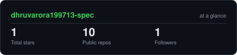
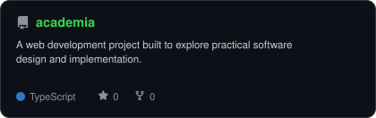
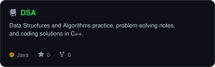
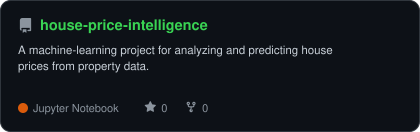
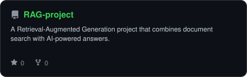

<div align="center">

<!-- PORTRAIT - generated by scripts/dotify.py from me.png.
     Colour mode, so one file serves both GitHub themes. Regenerate with:
       python3 scripts/dotify.py me.png -o assets/portrait \
         --cols 100 --equalize --detail 0.5 --color -->


<br>

<!-- NAME / TAGLINE - animated typing -->
<a href="https://github.com/dhruvarora199713-spec">
  
</a>

<br>

<!-- SOCIALS -->
<a href="https://linkedin.com/in/dhruv-arora-b35214355/"></a>
<a href="mailto:dhruvarora1997.13@gmail.com"></a>
<a href="https://leetcode.com/u/bIY8SoZxI4/"></a>


</div>

---

## `~/` whoami

```console
$ cat about.txt
```

Hi, I'm **Dhruv Arora**. I'm a Computer Science student who enjoys building things with software, exploring machine learning, and turning ideas into working projects.

- Currently building **Machine Learning + Full-Stack projects**
- Learning **Machine Learning + Web Development**
- Interested in **AI, Computer Vision, RAG systems & practical software**
- Fun fact: **I learn best when I'm actually building something.**

<br>

<div align="center">

## `~/` toolbox


</div>

---

<div align="center">

## `~/` skill radar

<table>
<tr>
<td width="50%" align="center" valign="middle">

<!-- Self-rated radar - edit assets/skills.json, the workflow redraws it -->
<picture>
  <source media="(prefers-color-scheme: dark)" srcset="assets/radar-dark.svg">
  <source media="(prefers-color-scheme: light)" srcset="assets/radar-light.svg">
  
</picture>

</td>
<td width="50%" align="center" valign="middle">

<!-- Live radar built from real language byte counts across your repos -->
<picture>
  <source media="(prefers-color-scheme: dark)" srcset="assets/radar-langs-dark.svg">
  <source media="(prefers-color-scheme: light)" srcset="assets/radar-langs-light.svg">
  
</picture>

</td>
</tr>
</table>

</div>

---

<div align="center">

## `~/` contribution calendar

<!-- 3D isometric calendar, regenerated every 6h by .github/workflows/metrics.yml -->


<br><br>

<!-- Snake eats the contribution graph - .github/workflows/snake.yml -->
<picture>
  <source media="(prefers-color-scheme: dark)" srcset="https://raw.githubusercontent.com/dhruvarora199713-spec/dhruvarora199713-spec/output/snake-dark.svg">
  <source media="(prefers-color-scheme: light)" srcset="https://raw.githubusercontent.com/dhruvarora199713-spec/dhruvarora199713-spec/output/snake.svg">
  
</picture>

</div>

---

<div align="center">

## `~/` the numbers

<!-- Generated by scripts/cards.py into this repo. Deliberately NOT
     github-readme-stats / streak-stats / github-profile-trophy: those are
     shared public instances that go down and take the whole section with them. -->
<picture>
  <source media="(prefers-color-scheme: dark)" srcset="assets/card-stats-dark.svg">
  <source media="(prefers-color-scheme: light)" srcset="assets/card-stats-light.svg">
  
</picture>

<br>


<br><br>


</div>

---

<div align="center">

## `~/` selected work

<!-- Cards generated by scripts/cards.py from assets/projects.json.
     Stars, forks and language are pulled live from the API on every run. -->
<table>
<tr>
<td width="50%">
  <a href="https://github.com/dhruvarora199713-spec/academia">
    <picture>
      <source media="(prefers-color-scheme: dark)" srcset="assets/card-academia-dark.svg">
      <source media="(prefers-color-scheme: light)" srcset="assets/card-academia-light.svg">
      
    </picture>
  </a>
</td>
<td width="50%">
  <a href="https://github.com/dhruvarora199713-spec/DSA">
    <picture>
      <source media="(prefers-color-scheme: dark)" srcset="assets/card-DSA-dark.svg">
      <source media="(prefers-color-scheme: light)" srcset="assets/card-DSA-light.svg">
      
    </picture>
  </a>
</td>
</tr>
<tr>
<td width="50%">
  <a href="https://github.com/dhruvarora199713-spec/house-price-intelligence">
    <picture>
      <source media="(prefers-color-scheme: dark)" srcset="assets/card-house-price-intelligence-dark.svg">
      <source media="(prefers-color-scheme: light)" srcset="assets/card-house-price-intelligence-light.svg">
      
    </picture>
  </a>
</td>
<td width="50%">
  <a href="https://github.com/dhruvarora199713-spec/RAG-project">
    <picture>
      <source media="(prefers-color-scheme: dark)" srcset="assets/card-RAG-project-dark.svg">
      <source media="(prefers-color-scheme: light)" srcset="assets/card-RAG-project-light.svg">
      
    </picture>
  </a>
</td>
</tr>
</table>

<sub>

| project | live | stack |
|---|---|---|
| **[academia](https://github.com/dhruvarora199713-spec/academia)** | — | `Web Development` |
| **[DSA](https://github.com/dhruvarora199713-spec/DSA)** | — | `C++` `DSA` |
| **[house-price-intelligence](https://github.com/dhruvarora199713-spec/house-price-intelligence)** | — | `Python` `Machine Learning` |
| **[RAG-project](https://github.com/dhruvarora199713-spec/RAG-project)** | — | `Python` `RAG` |

</sub>

</div>

---

<div align="center">

<sub>`01110100 01101000 01100001 01101110 01101011 01110011 00100000 01100110 01101111 01110010 00100000 01110011 01100011 01110010 01101111 01101100 01101100 01101001 01101110 01100111`</sub>

</div>